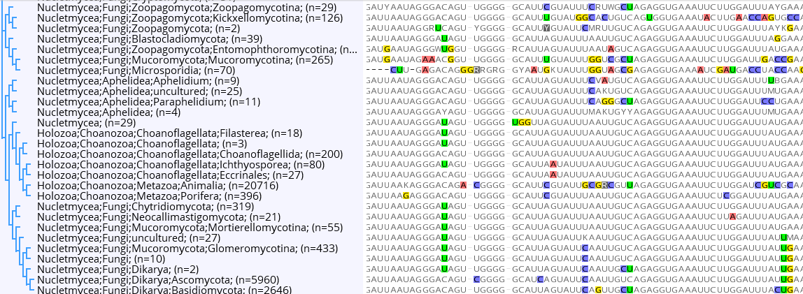

Usage
=====

.. _installation:

Installation
------------

To use *seq_consensus*, first install it using pip:

.. code-block:: console

   (.venv) $ pip install seq_consensus@git+https://github.com/markschl/seq_consensus

Using the Python library
------------------------

Example using the :py:func:`seq_consensus.consensus` function:

>>> from seq_consensus import consensus
>>> seqs = [
>>>     'ATTGC',
>>>     'AT-CC',
>>>     'RT-C-'
>>> ]
>>> consensus(seqs, threshold=0.6)
'AT-CC'

With a more strict threshold, ambiguities are introduced, as well as a '?', which indicates that the mix of one T base and two gaps resulted in an ambiguous situation:

>>> consensus(seqs, threshold=0.9)
'RT?SC'

The result also depends on whether terminal gaps are ignored or not. The default is to ignore them, but this can be changed:

>>> consensus(seqs, threshold=0.9, free_endgaps=False)
'RT?S?'

**Advanced use**

If sequences are not available all at once, it is possible to use
:py:class:`seq_consensus.AlignmentFrequencies`
and call the consensus later:

>>> from seq_consensus import AlignmentFrequencies
>>> freqs = AlignmentFrequencies()
>>> for seq in seqs:
>>>     freqs.add(seq)
>>> freqs.consensus()
'AT-CC'

The consensus matrix (which is a *numpy* array) can also be accessed:

>>> letters, matrix = freqs.normalized_matrix()
>>> letters
'ACGT-'
>>> matrix
array([[2.5, 0. , 0. , 0. , 0. ],
       [0. , 0. , 0. , 2. , 2. ],
       [0.5, 0. , 0. , 1. , 0. ],
       [0. , 3. , 1. , 0. , 0. ],
       [0. , 0. , 2. , 0. , 0. ]])

The row order corresponds to the order of the letters. The last row (no. 5)
contains the internal gap count.
*Note* that the letter 'R' contributes half to 'A' and half to 'G', which
explains the decimal numbers in the first column.

A matrix containing the original counts with ambiguities is obtained using
:py:meth:`seq_consensus.AlignmentFrequencies.matrix`.

Commandline tool
----------------

The commandline tool `cons_tool` offers an easy way to interact with sequences
stored in the FASTA format.

It additionally requires the `biopython` package for reading/writing FASTA (optional dependency not automatically installed with `seq_consensus`).

The default is to create a consensus at a threshold of 0.5, reading from standard input and writing to standard output.

.. code-block:: bash

   cons_tool input.fasta

With more strict threshold:

.. code-block:: bash

   cons_tool -t 0.9 input.fasta

**Consensus groups**

It is also possible to generate multiple consensus sequences given a regular expression, which extracts groups.

In this example, a FASTA header looks like this: `>ID;group=groupname`, and we want to extract `groupname`.

.. code-block:: bash

   cons_tool -k '.+?;group=(\w+)' input.fasta > consensus.fasta

More complex grouping with regex groups is also possible. See `cons_tool -h` for more information.

Another possibility is to generate the consensus from multiple files with one command.
The headers will contain the file names:

.. code-block:: bash

   cons_tool my_alignments/*.fasta > consensus.fasta

A combination of multiple files and grouping with `--key` is also possible.

**Example: compare taxonomic groups**

The tool is useful for quickly comparing different taxonomic groups in alignments.
In this example, we have a look at aligned SSU sequences provided by `SILVA <https://www.arb-silva.de>`_.
We only look at a subgroup of eukaryote 18S sequences (opisthokonts,  sequences).
Including all sequences would be possible, but take a long time (the alignment is a 2GB GZIP file,
and even though the library is reasonably fast and uses little memory, it can
become slow with such large files).
We use `seqtool <https://github.com/markschl/seqtool>`_ (`st` command) for filtering.

.. code-block:: bash

   # download
   url=https://www.arb-silva.de/fileadmin/silva_databases/release_138/Exports/SILVA_138_SSURef_NR99_tax_silva_full_align_trunc.fasta.gz
   wget -O - $url | zcat | st find -f --desc 'Opisthokonta;' > SILVA_Opisthokonta.fasta

   # obtain consensus of
   cons_tool SILVA_Opisthokonta.fasta -o SILVA_Opisthokonta_cons.fasta \
      -e '.' -T rna \
      -c 0.01 \
      -k 'Opisthokonta;((\w+?;){1,4})' \
      -H '\g<1> n={n}'

Some explanation regarding the commandline arguments: '-e '.' -T rna' tells the
tool about end gaps and the molecule type. '-c 0.05' suppresses the output of
columns with very few non-gap columns (requires at least 5% non-gap columns).
The '-k' option defines the regex pattern that matches the taxonomic ranks
in the sequence header (used for grouping), and the '-H' option defines, how
the FASTA headers of the consensus sequences are composed. '\\g<1>' references
the first regex group (pattern in parentheses), thus making sure that
'Opisthokonta' does not appear in the headers.

The following screenshot from the Geneious software shows the output
(additionally reordered using the FastTree plugin):

Alternatively, it would be an option to visualize the alignment directly on the
commandline using `seqtool`'s [view](https://github.com/markschl/seqtool/wiki/view)
command:

.. code-block:: bash

   st view -di60 SILVA_Opisthokonta_cons.fasta
